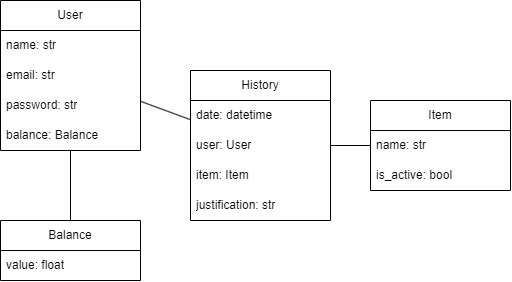
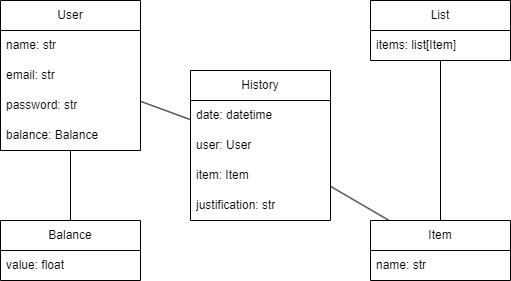

# _Homework Reminder_: a solution for multi-platform homeworks

## Content

- [Rationale](#rationale)
- [Purpose](#purpose)
- [System Details](#system-details)
- [How it works](#how-it-works)
<!-- - [Installation](#installation) -->

### Rationale

This project aims to cover and review knowledge about Django, Git and Vue. It should also serve as a challenge, so that we can broaden and consolidate our skills.

### Purpose

With the use of various platforms for the application of tasks and assignments, forgetting delivery dates is plausible (and normal). The purpose of this little system is to serve as a _hub_ for recording the dates of presentations, assignments and exams.

### System details

<h4>Figure 1: Use Case Diagram</h4>

 

<h4>Figure 2: Class Diagram</h4>

### How it works

<!-- ### Installation -->
