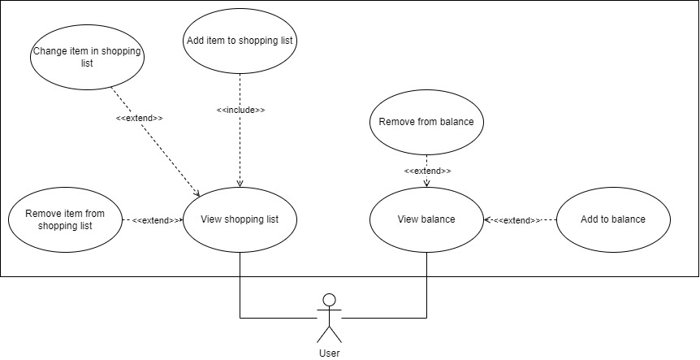

# _FabricaNeeds_: managing demands from the _Fábrica de Software_'s kitchen

## Content

- [Rationale](#rationale)
- [Purpose](#purpose)
- [System Details](#system-details)
  - [Diagrams](#diagrams)
  - [Mockups](#mockups)
- [How it works](#how-it-works)
<!-- - [Installation](#installation) -->

## Rationale

This project aims to cover and review knowledge about Django, Git and Vue. It should also serve as a challenge, so that we can broaden and consolidate our skills.

## Purpose

WIP

## System details

### Diagrams:

<h4>Figure 1: Use Case Diagram</h4>

 

<h4>Figure 2: Class Diagram</h4>

### Mockups:

<h4>Figure 3: Color Palette</h4>

 

<h4>Figura 4: Home page</h4>

 

<h4>Figura 5: History Page</h4>

 

<h4>Figura 6: Sign-up page</h4>

 

<h4>Figura 7: Sign-in page</h4>

 

<h4>Figuras 8: System Components (Navigation sidebar and Items purchase)</h4>

## How it works

<!-- ### Installation -->
