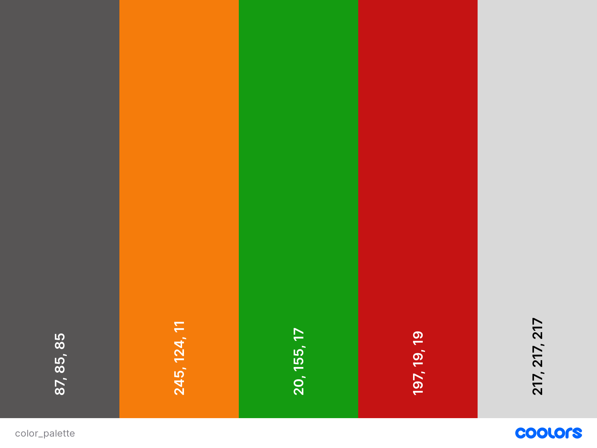
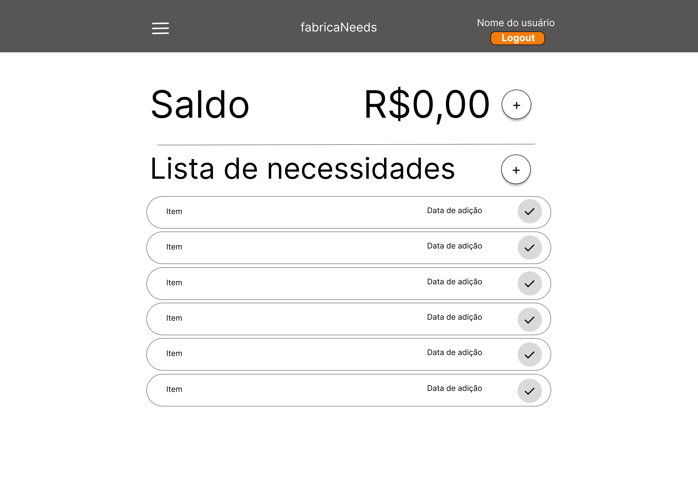
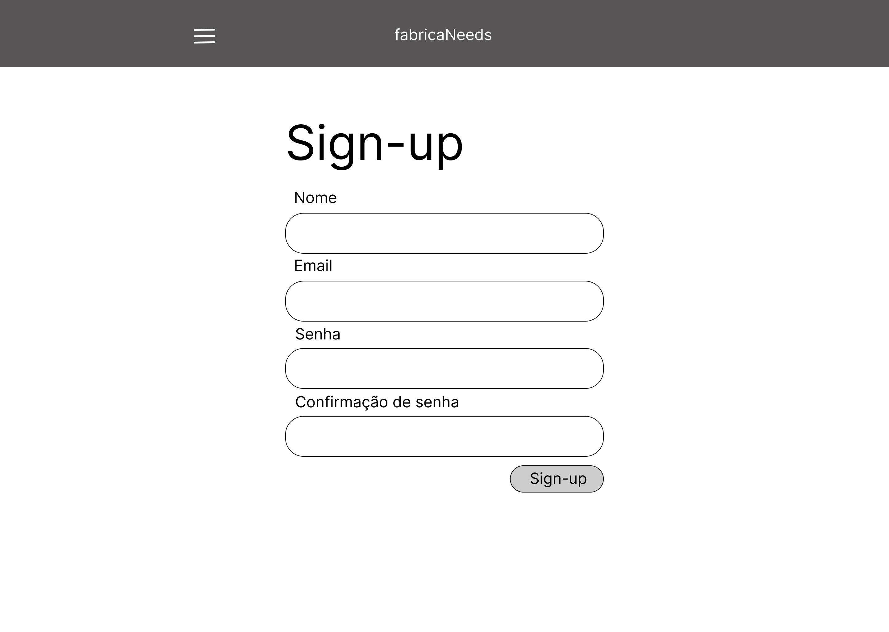

# _FabricaNeeds_: gestão de demandas da cozinha da Fábrica de Software

## Conteúdo

- [Justificativa](#justificativa)
- [Propósito](#propósito)
- [Detalhes do Sistema](#detalhes-do-sistema)
  - [Diagramas](#diagramas)
  - [Mockups](#mockups)
- [Funcionamento](#funcionamento)
<!-- - [Instalação](#instalação) -->

## Justificativa

Este projeto tem como objetivo abranger e revisar o conhecimento sobre Django, Git e Vue. Além disso, deverá servir como um desafio, para que possamos ampliar e consolidar nossas habilidades.

## Propósito

WIP

## Detalhes do Sistema:

Esta seção apresentará os detalhes em relação à engenharia do projeto, como diagramas e mockups.

### Diagramas:

<h4>Figura 1: Diagrama de Casos de Uso</h4>

 

<h4>Figura 2: Diagrama de Classes</h4>

### Mockups:

<h4>Figura 3: Paleta de Cores</h4>

 

<h4>Figura 4: Página Inicial</h4>

 

<h4>Figura 5: Página de Histórico</h4>

 

<h4>Figura 6: Página de Cadastro</h4>

 

<h4>Figura 7: Página de Login</h4>

 

<h4>Figuras 8: Componentes do Sistema (Barra de navegação lateral e Compra de itens)</h4>

## Funcionamento

<!-- ### Instalação -->
