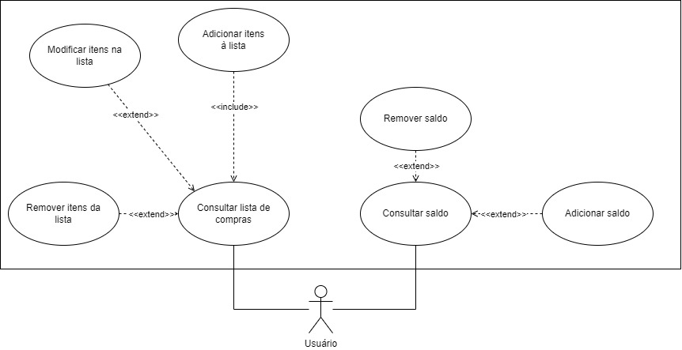

# _Homework Reminder_: uma solução para tarefas em múltiplas plataforma

## Conteúdo

- [Justificativa](#justificativa)
- [Propósito](#propósito)
- [Detalhes do Sistema](#detalhes-do-sistema)
- [Funcionamento](#funcionamento)
<!-- - [Instalação](#instalação) -->

### Justificativa

Este projeto tem como objetivo abranger e revisar o conhecimento sobre Django, Git e Vue. Além disso, deverá servir como um desafio, para que possamos ampliar e consolidar nossas habilidades.

### Propósito

Com a utilização de várias plataformas para a aplicação de tarefas e trabalhos, o esquecimento das datas de entrega é algo plausível (e normal). Este pequeno sistema tem o propósito de servir como um _hub_ para o registro das datas de apresentações, entregas e provas.

### Detalhes do Sistema

<h4>Figura 1: Diagrama de Casos de Uso</h4>

 

<h4>Figura 2: Diagrama de Classes</h4>

### Funcionamento

<!-- ### Instalação -->
